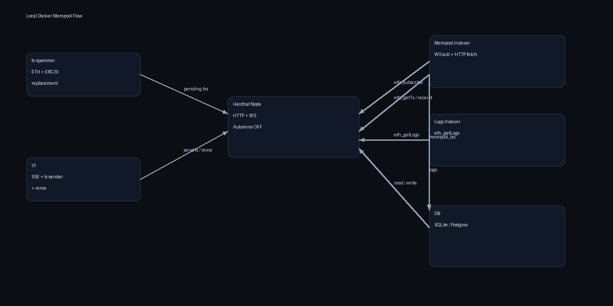

# blockchain-data-feeds-poc

Production-shaped PoC for indexing EVM logs via JSON-RPC (`eth_getLogs`) and a mempool (pending tx) feed via WebSockets.

## Practical setup recommendation

Use `network` + `networks` in `config.yaml` so you can switch environments without rewriting RPC URLs:

```yaml
network: "local"

networks:
  local:
    rpc_url: "http://127.0.0.1:8545"
    chain_id: 31337
  sepolia:
    rpc_url: "https://ethereum-sepolia-rpc.publicnode.com"
    chain_id: 11155111
  mainnet:
    rpc_url: "https://ethereum-rpc.publicnode.com"
    chain_id: 1
```

## Quick start (logs indexer)

1) Copy the sample config and adjust contract addresses:

```bash
cp configs/config.sample.yaml configs/config.local.yaml
```

2) Run migrations:

```bash
go run ./cmd/indexer db migrate --config configs/config.local.yaml
```

3) Backfill a range:

```bash
go run ./cmd/indexer index backfill --config configs/config.local.yaml --from 1 --to 50
```

4) Follow head:

```bash
go run ./cmd/indexer index follow --config configs/config.local.yaml
```

## Mempool quick start (Docker)

This uses a fully containerized Hardhat node + tx spammer so you don’t need Node or Hardhat installed locally.

```bash
docker compose -f local/docker/docker-compose.yml up --build
```

Optional port exposure:

```bash
docker compose -f local/docker/docker-compose.yml -f local/docker/docker-compose.expose.yml up --build
```

UI (when exposed) is available at `http://localhost:8080`.

See `docs/mempool.md` and `local/docker/README.md` for details.

## Flow diagram (local Docker)



## Local testing without Docker (logs indexer only)

1) Start Anvil:

```bash
anvil --chain-id 31337 --block-time 1
```

2) Deploy a tiny ERC-20 and emit a `Transfer` (using Foundry):

```bash
mkdir -p /tmp/anvil-token && cd /tmp/anvil-token
forge init --no-git
cat > src/TestToken.sol <<'SOL'
// SPDX-License-Identifier: MIT
pragma solidity ^0.8.20;
contract TestToken {
    event Transfer(address indexed from, address indexed to, uint256 value);
    string public name = "TestToken";
    string public symbol = "TT";
    uint8 public decimals = 18;
    uint256 public totalSupply;
    mapping(address => uint256) public balanceOf;

    function mint(address to, uint256 amount) external {
        balanceOf[to] += amount;
        totalSupply += amount;
        emit Transfer(address(0), to, amount);
    }
    function transfer(address to, uint256 amount) external returns (bool) {
        require(balanceOf[msg.sender] >= amount, "bal");
        balanceOf[msg.sender] -= amount;
        balanceOf[to] += amount;
        emit Transfer(msg.sender, to, amount);
        return true;
    }
}
SOL

forge build
forge create --rpc-url http://127.0.0.1:8545 \
  --private-key <ANVIL_PRIVATE_KEY> \
  src/TestToken.sol:TestToken

cast send <DEPLOYED_ADDRESS> "mint(address,uint256)" <RECIPIENT> 1000 \
  --rpc-url http://127.0.0.1:8545 --private-key <ANVIL_PRIVATE_KEY>
```

3) Point your config to Anvil and update the contract address:

```yaml
network: "local"

networks:
  local:
    rpc_url: "http://127.0.0.1:8545"
    chain_id: 31337

contracts:
  - name: "TestToken"
    address: "<DEPLOYED_ADDRESS>"
    abi_path: "abis/erc20.json"
    events: ["Transfer"]
```

4) Run:

```bash
go run ./cmd/indexer db migrate --config configs/config.local.yaml
go run ./cmd/indexer index backfill --config configs/config.local.yaml --from 1 --to 50
```

## Mempool command

```bash
go run ./cmd/indexer index mempool --config configs/config.local.yaml --track
```

## UI command

```bash
CONFIG_PATH=configs/config.local.yaml go run ./cmd/ui
```

In the UI, use **Load Latest** + **Apply to Config** to wire the deployed token into the logs feed.

Flags:
- `--decode-input`
- `--track`
- `--dropped-ttl 10m`
- `--pending-workers N`
- `--receipt-workers N`

## Config overview

See `configs/config.sample.yaml` for all fields.

- `network`: Selected network key
- `networks`: Named RPC URLs and chain IDs
- `indexer.start_block`: Default start for follow/backfill
- `indexer.confirmations`: Blocks to wait before indexing
- `indexer.chunk_size`: Initial `eth_getLogs` range size
- `indexer.min_chunk_size` / `max_chunk_size`: Adaptive bounds
- `indexer.concurrency`: Worker pool size
- `indexer.rate_limit_per_second`: RPC request rate limit
- `database.driver`: `sqlite` (default) or `postgres` (build tag)
- `database.dsn`: Connection string
- `mempool.ws_url` / `mempool.http_url`: WebSocket/HTTP endpoints
- `mempool.pending_workers` / `mempool.receipt_workers`
- `mempool.dropped_ttl` / `mempool.decode_input` / `mempool.track_lifecycle`
- `mempool.max_inflight_hashes`
- `contracts`: List of contracts, each with ABI file and event names

## Schema

Normalized log storage:

```
chain_id, contract_address, event_name, block_number, block_hash,
tx_hash, log_index, timestamp, args_json, topics_json, data_hex, inserted_at
```

Mempool storage:

```
chain_id, tx_hash, from_addr, to_addr, nonce, value, gas, gas_price,
max_fee_per_gas, max_priority_fee_per_gas, tx_type, input, status,
first_seen_at, last_seen_at, mined_block_number, mined_block_hash,
mined_tx_index, replaced_by_tx_hash, decoded_input_json, inserted_at
```

Unique constraint: `(chain_id, tx_hash, log_index)` for logs and `tx_hash` for mempool.

## SQLite vs Postgres

SQLite uses `modernc.org/sqlite` (pure Go). For Postgres:

```bash
go run -tags=postgres ./cmd/indexer db migrate --config configs/config.local.yaml
```

## Add a new contract/event feed

1) Drop ABI JSON into `abis/`
2) Add contract entry in config:

```yaml
contracts:
  - name: "MyToken"
    address: "0x..."
    abi_path: "abis/mytoken.json"
    events: ["Transfer", "Approval"]
```

3) Run backfill or follow.

## Development

```bash
go test ./...
```
