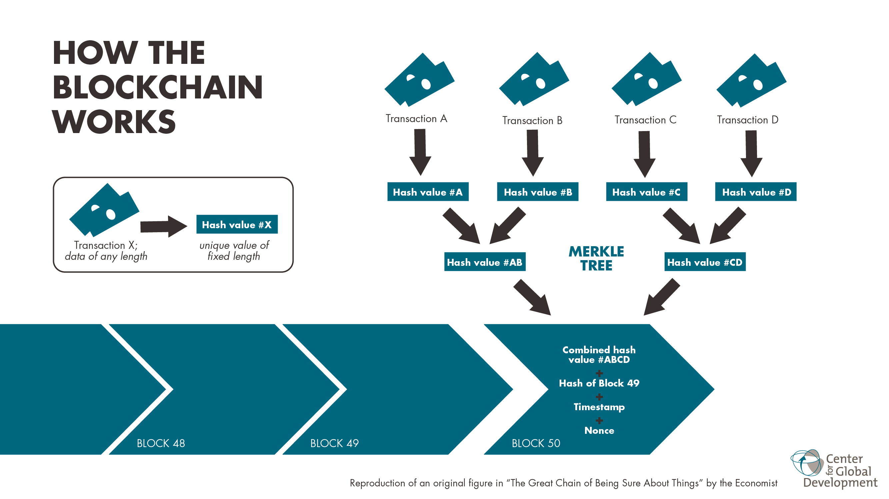

# Blockchain Guide (Start Here)

This guide starts with fundamentals and moves toward practical, advanced flows used in this repo.

## 1) What is a blockchain?

A blockchain is a distributed, append‑only ledger. It stores transactions in **blocks** that are linked together by cryptographic hashes. Each block references the previous block’s hash, making history tamper‑evident.

### Core properties
- **Append‑only**: data is added, not modified
- **Verifiable**: hashes link blocks; anyone can validate
- **Distributed**: many nodes store and verify the chain

## 2) Basic architecture

### Main components
- **Transactions**: signed instructions (transfer ETH, call a contract)
- **Blocks**: batches of transactions + metadata
- **State**: current balances and contract storage
- **Consensus**: rules to decide the canonical chain

Image source: Wikimedia Commons “Blockchain workflow.png” (CC BY-SA 4.0).

### How it works (simplified)
1) A user signs a transaction and sends it to the network.
2) Nodes put it in a **mempool** (pending transactions).
3) A block producer includes some pending txs in a block.
4) The block is broadcast; nodes verify and add it to the chain.

## 3) Ethereum (ETH)

Ethereum is a blockchain that supports **smart contracts** (programs on-chain). ETH is its native currency.

Key differences vs “payment only” chains:
- **Smart contracts**: arbitrary business logic
- **Events/Logs**: contracts can emit structured data
- **EVM**: the execution environment

## 4) Terms used in this repo

### Transaction lifecycle
- **Mempool**: pending txs not yet in a block
- **Mined**: included in a block
- **Replaced**: same sender + nonce, higher fee
- **Dropped**: never mined (expired or discarded)

### Blocks & confirmations
- **Block**: a set of txs + metadata
- **Head**: latest block
- **Confirmations**: blocks after a tx’s block (used for safety)
- **Reorg**: chain reorganization; some blocks get replaced

### Fees & execution
- **Gas**: unit of computation
- **Gas limit**: max gas a tx can consume
- **Gas price**: fee per gas (legacy)
- **Max fee / priority fee**: EIP‑1559 fee model
- **Nonce**: per‑account tx sequence number

### Logs & events
- **Logs/Events**: structured contract output stored in block receipts
- **Topics**: indexed fields used for filtering
- **ABI**: contract interface used for decoding input/output

### RPC / WS
- **JSON‑RPC**: standard HTTP API (eth_getLogs, eth_getTx)
- **WebSocket**: subscription API (eth_subscribe)

## 5) Beginner flow (conceptual)

1) Run a local node (Hardhat or Anvil).
2) Send a transaction.
3) See it in the **mempool** (pending).
4) Mine a block; see it become **mined**.
5) Query logs emitted by a contract.

## 6) Beginner flow (in this repo)

### Mempool feed (pending)
- Subscribe to `newPendingTransactions` via WebSocket.
- Fetch full txs over HTTP (`eth_getTransactionByHash`).
- Track state changes: pending → mined / replaced / dropped.

### Logs feed (confirmed)
- Query `eth_getLogs` by block ranges.
- Decode events using ABI.
- Store normalized rows for fast querying.

## 7) Intermediate flow: indexing at scale

- **Chunking**: split `eth_getLogs` into block ranges.
- **Adaptive chunking**: shrink when RPC returns “too many results”.
- **Concurrency**: multiple workers, bounded by rate limits.
- **Idempotency**: unique constraints prevent duplicates.

## 8) Advanced flow: safety & reliability

- **Confirmations**: process only blocks older than N.
- **Reorg handling**: rollback when block hash changes.
- **Metrics**: track lag, errors, and throughput.
- **Backfill + follow**: historical + real‑time ingestion.

## 9) How to think about feeds

- **Mempool feed** = *intent* (not final)
- **Logs feed** = *truth* (confirmed)

Use cases:
- Mempool: real‑time alerts, front‑running detection, intent analysis
- Logs: analytics, accounting, historical data

## 10) Next steps (we’ll extend later)

- Multi‑chain support
- More event types and ABI management
- Faster storage/querying
- Advanced reorg strategies
- Filtering, enrichment, and indexing pipelines
